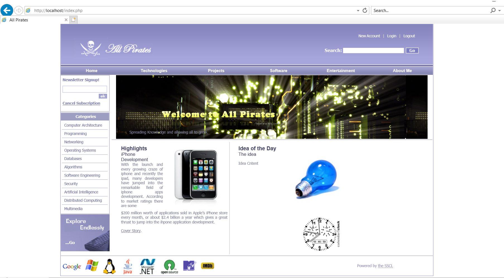
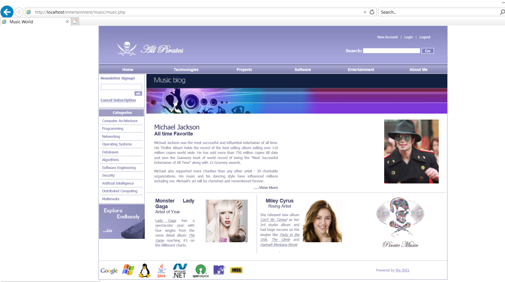
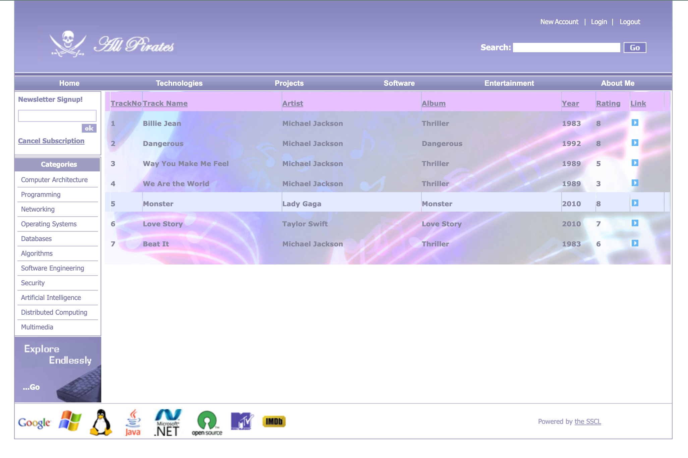
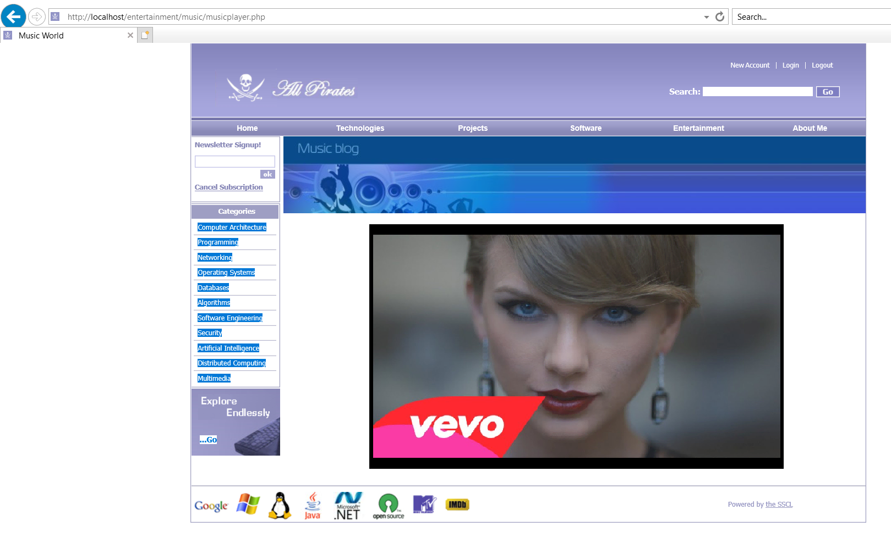
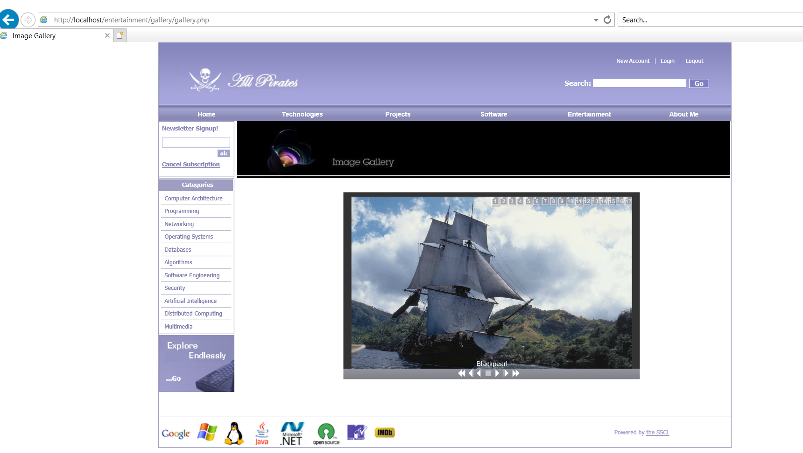
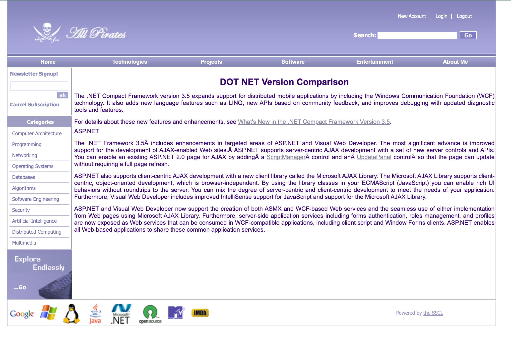
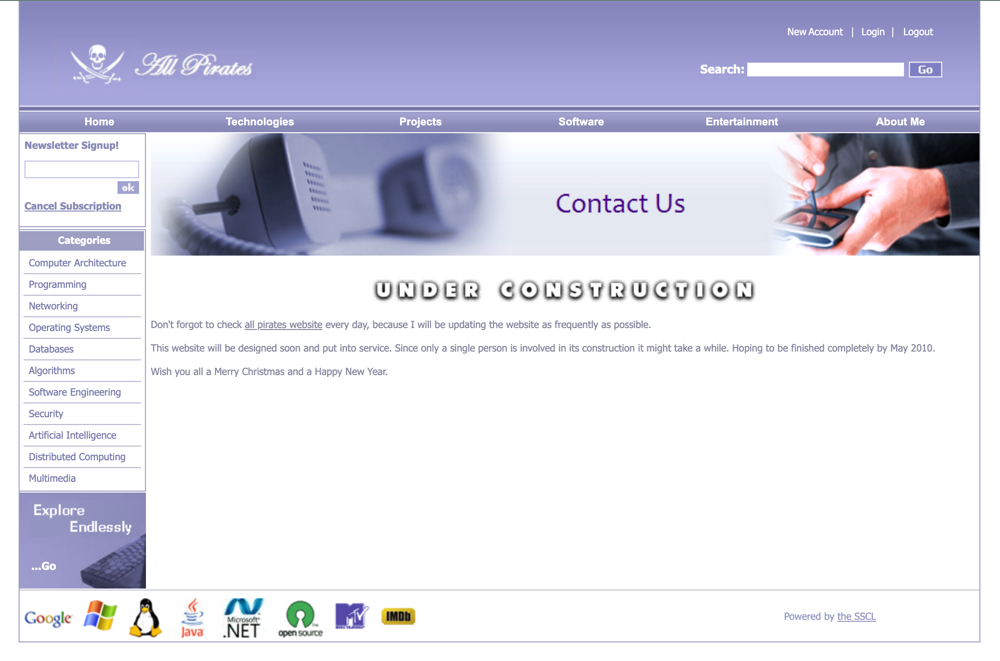

# All Pirates Website (2010)

All Pirates website was a showcase website presenting various content ranging from media videos, source code, rich text articles, images etc. It required Flash to drive the animations, video player and rendering images.

## All Pirates Home

   

## All Pirates Music World

   

## All Pirates Music Listing

   

## All Pirates Music Video

   

## All Pirates Image Gallery

   

## All Pirates Programming

   

## All Pirates Articles

   

## All Pirates Contact

   

## Requirements

* PHP
* MySQL
* Adobe Flash

## Setup and Configuring Apache Http Server for Windows

Use the Microsoft Windows Installer version of Apache. Visit the Apache Web Site at www.apache.org. Follow the links to the download page. The current MSI file is `apache_2.0.49-win32-x86-no_ssl.msi`. If you intend to continue to use IIS, as I do, you will need to stop IIS before proceeding with the installation. After stopping IIS, locate the msi file and double-click on it. Since you are only using a development server, you can just insert dummy data at every occasion that Apache asks.

It is recommended to accept the All Users, Port 80 option. If we want to use another port, we can set this up later, in the configuration file.
Finally, you are asked to click install. You can now find Apache, as a Windows service, in the Control Panel, under **Administrative Tools > Services**.
Configuring Apache will be analogous, whatever platform you are on. These instructions will be for a Windows environment. The only changes you will need will be to account for the different way file paths are described on Linux, Mac and Windows. On all platforms, Apache is configured by a file called httpd.conf. Open this file up in a text editor. (I often need multiple text files, so I use NoteTab in preference to NotePad. NoteTab is free, and is available from www.notetab.com. On Linux (I’m using Mandrake 9.1); I use Quanta, which also permits multiple files open.).

Find the line referring to Listen.

    Listen 80

If you are running 2 web servers, change this line to

    Listen 8080

If left at 80, you will access the web server at http://localhost. Otherwise, it will be at http://localhost:8080. Whenever you make a change to this httpd.conf file, you must restart Apache, for it to recognise the changes. Find the document root statement.

    DocumentRoot "C:/Program Files/Apache Group/Apache2/htdocs"

Check it describes the actual position of the web server root. Unix type document roots do not need to be in quotes, but Windows paths work better in quotes. Don’t ask me why! Notice also that the Windows backslashes are rendered as forward slashes. As with IIS, you could simply place your sites as subfolders of the web root. Thus, **C:\Program Files\Apache Group\Apache2\htdocs\mysite** would be served as http://localhost/mysite.
As with IIS, it is usually more convenient to have the folders elsewhere. In Apache, this is referred to as an alias. Search **httpd.conf** for the word alias. You will see a couple of aliases set by default. The script gives other examples, in the commented lines (any line beginning # is a comment line, and ignored at execution). Here is a typical alias off my machine.

    # permission for emprovise folder
    Alias /emprovise "C:/webs/emprovise"
    <Directory "C:/webs/emprovise">
    Options Indexes MultiViews
    AllowOverride None
    Order allow,deny
    Allow from all
    </Directory>

I have added a comment for each alias to make it easy to find. The Alias command defines the nature of the alias. This is saying that **C:\webs\emprovise** will be served as http://localhost/emprovise. The information in the Directory tags sets the permissions. We enter:

    # permission for phpbattybooks folder
    Alias /phpbattybooks "C:/webs/phpbattybooks"
    <Directory "C:/webs/phpbattybooks">
    Options Indexes MultiViews
    AllowOverride None
    Order allow,deny
    Allow from all
    </Directory>

As usual, after any changes, save **httpd.conf**, and restart Apache.

## Installing PHP

Download the whole PHP zipped package instead of using the Windows Installer. PHP is obtained from www.php.net, where you will find detailed instructions on installation, which is not difficult.

* Stop Apache
* Download zip file **Php-4.3.1-Win32.zip**, rather than win installer.
* Extract contents to **C:\php**
* Copy **php.ini-dist** to your Windows directory – Windows in XP, WINNT in 2000. Rename it as php.ini
* Copy **php4ts.dll** from C:\php to C:\Windows\System32
* Edit **php.ini** in a text editor, as shown in the next few lines
* Find the line extension_dir = ./
* Amend to **extension_dir = "C:\php"**
* Find line **doc_root = ./**
* Amend line to **doc_root = "C:\Program Group\Apache2\htdocs"**
* Find line **session.save_path = ./tmp**
* Amend line to **session.save_path = "C:\tmp"**. Make sure that the folder **"C:\tmp"** exists, or use another folder in the **php.ini** file.
* Save and close php.ini.
* Open **httpd.conf** in text editor
* Look for lines beginning LoadModule. Add these lines

      LoadModule php4_module "C:/php/sapi/php4apache2.dll"
      AddType application/x-httpd-php .php

* Save file
* Start Apache

The next job is to test that php is working. Create a file in a text editor, or Dreamweaver. Fill it with this code:

      <?php
           phpinfo();
      ?>

Save the file into the root of the Apache web server, as phpinfo.php. Call the file up in your browser, e.g. as http://localhost:8080/phpinfo.php When you do this, you should see a page of information about PHP. This will show that your installation is working. If you do not get such a page, check all the steps above very carefully.
